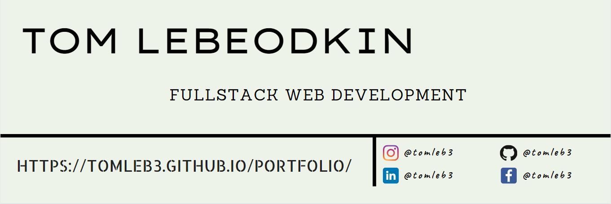

## 

&nbsp;&nbsp;
&nbsp;&nbsp;
&nbsp;&nbsp;
&nbsp;&nbsp;
&nbsp;&nbsp;

- 🔭 I’m currently working on [Instapound](https://github.com/tomleb3/instapound) (an Instagram clone)
- 📖 Check out my [Portfolio](https://tomleb3.github.io/portfolio/)
- 💬 Ask me about anything

<h3 align="left">Languages & Tools:</h3>

  &nbsp;
  &nbsp;
  &nbsp;
  &nbsp;
  &nbsp;
  &nbsp;
  &nbsp;
  &nbsp;
  &nbsp;
  &nbsp;
  &nbsp;

